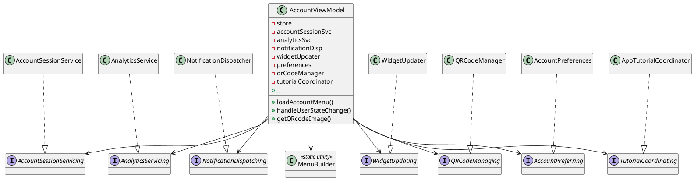

# AccountViewModel: Separated Concerns & Architecture Diagram

This document summarizes the major separated concerns for `AccountViewModel` and visualizes the suggested architecture for the `MyAccount` (Costco-Digital) module after refactoring.

---

## Separated Concerns

| Concern                                | Extraction Target/Class             | Description |
|-----------------------------------------|-------------------------------------|-------------|
| 1. Combine subscription patterns        | Subscription helper method          | Generic helper to reduce repetitive `.sink` code. |
| 2. Menu logic                          | `MenuBuilder` (utility class)       | Sorting, filtering, and updating menu sections/items. |
| 3. Session/business/logout logic        | `AccountSessionService`             | Handles side effects, logout, and session clearing. |
| 4. QR code & card logic                 | `QRCodeManager`, `QRCodeGenerator`  | QR code generation/caching, card filtering, eligibility. |
| 5. Analytics/notification/widget logic  | `AnalyticsService`, `NotificationDispatcher`, `WidgetUpdater` | Analytics, notification posting, widget updates. |
| 6. Storage/key-value/defaults           | `AccountPreferences`                | Centralizes user/session storage and key management. |
| 7. Tutorial/app tutorial logic          | `AppTutorialCoordinator`            | Handles when/how to show/dismiss tutorials. |

---

## Suggested Architecture Diagram

Textual class diagram using PlantUML syntax for clarity and tool compatibility:

---

## Diagram Explanation

- **AccountViewModel**: Central orchestrator, exposes UI state and delegates logic to collaborators.
- **MenuBuilder**: Pure utility (static) for menu transformations.
- **AccountSessionService**: Handles business/session/logout logic.
- **QRCodeManager**: Caches and generates QR codes, handles card logic.
- **AnalyticsService, NotificationDispatcher, WidgetUpdater**: Handle analytics, notifications, and widget updates, respectively.
- **AccountPreferences**: Abstracts all user/session storage and key-value logic.
- **AppTutorialCoordinator**: Orchestrates all tutorial display logic.

**All dependencies are injected, and each concern is isolated for testability and maintainability.**

---
