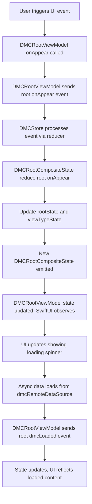
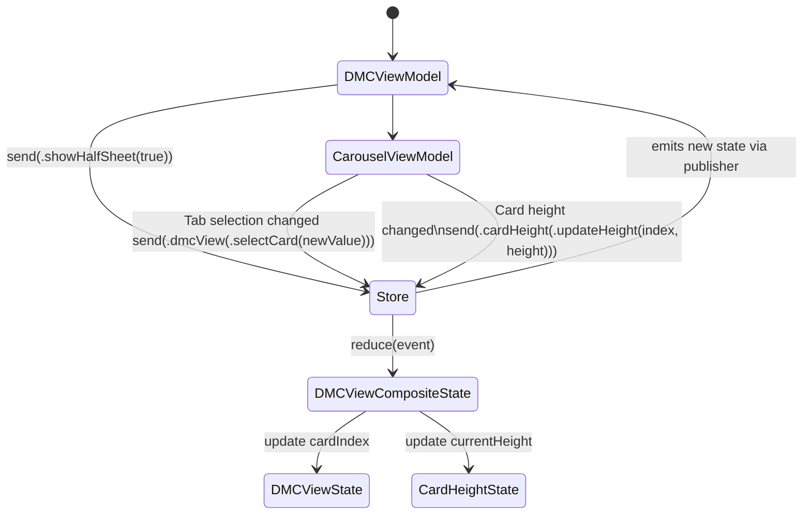

# DMC Redux-Style Architecture Documentation

This documentation outlines the implementation of a Redux-style architecture using Swift's `actor`, `Combine`, and clean separation of state and events.

---

## Architecture Overview

This architecture introduces a generic `DMCStore` that acts as a centralized state container. It uses reducers to update state, supports side effects, and is designed to be SwiftUI-friendly through `ViewModelStore`.

---

# DMCStore

`DMCStore` is a concurrency-safe, actor-based implementation of a Redux-like store.
`DMCStore` is a generic actor-based state container that enables predictable state management using a reducer-based architecture. It supports unidirectional data flow and is designed for integration with reactive frameworks like Combine or SwiftUI.

## Purpose

The `DMCStore` manages state updates in response to dispatched events. It's built around a reducer function that takes the current state and an event, and returns a new state. It also provides reactive state observation via Combine.

Ideal for:
- MVVM/MVI architectures.
- Decoupling business logic from UI.
- Scalable, testable state-driven designs.

### Features:
- **State Management**: Uses reducer functions to immutably mutate the current state.
- **Concurrency Safety**: Leveraged via Swift `actor`.
- **Reactivity**: Exposes state changes using a `Combine` `CurrentValueSubject`.
- **Side Effects**: Allows handling post-dispatch effects via `afterDispatchEffect`.

## Declaration

```swift
actor DMCStore<State: Equatable, Event>
```

- State: A model representing the application's current state. Must conform to Equatable.

- Event: Represents actions or intentions that mutate state.

## Initialization

```swift
init(initialState: State,
     reducer: @escaping (inout State, Event) -> Void)
```

- `initialState`: The starting state of the store.

- `reducer`: A pure function that applies state changes based on the incoming event.

## Properties & Methods

| Property / Method                   | Description |
|------------------------------------|-------------|
| `private let reducer`              | A reducer function that applies business logic and state mutation. |
| `private nonisolated let subject`  | A `CurrentValueSubject` that broadcasts the current state to observers. |
| `var afterDispatchEffect`          | Optional side-effect closure called after state dispatch completes. |
| `nonisolated var stateObvserver`  | A read-only `AnyPublisher<State, Never>` to observe state changes. |
| `nonisolated var currentState`     | Provides the current state value synchronously (thread-safe). |
| `func dispatch(_ event:)`          | Applies the reducer, updates state if needed, and triggers side effects. |
| `func setAfterDispatchEffect(_:)`  | Allows setting a side effect closure for post-dispatch actions. |
| `nonisolated func send(_:)`        | Public API for dispatching an event asynchronously using `Task`. |

## State Flow

1. Events are dispatched via `send(_:)`.
2. The reducer applies changes to a new state copy.
3. If the new state is different (`Equatable`), the `subject` emits it to subscribers.
4. Any configured `afterDispatchEffect` is executed after the state change.


## Threading & Isolation

- The `DMCStore` is an `actor`, ensuring thread-safe mutation of state and reducer logic.
- Reading `stateObvserver` and `currentState` is marked `nonisolated` for safe usage in SwiftUI or Combine outside the actor context.
- Event dispatch is wrapped in a `Task` to ensure asynchronous, actor-safe execution.

## 🧪 Example Usage

```swift
let store = DMCStore(initialState: AppState()) { state, event in
    switch event {
    case .increment:
        state.counter += 1
    }
}

store.setAfterDispatchEffect { event in
    print("Dispatched event: \(event)")
}

store.send(.increment)
```
---
# ViewModelStore


A **SwiftUI-friendly wrapper** around `DMCStore`. It observes store changes and exposes a `@Published` state property for UI binding.

The `ViewModelStore` is a generic observable class that bridges a `DMCStore` (a state-management abstraction) with SwiftUI views. It enables reactive UI updates based on state changes and dispatching events from the UI to the underlying store.

## Purpose

The main purpose of `ViewModelStore` is to:

- Hold and expose the current state to the UI using `@Published`.
- Observe and react to state changes from the underlying `DMCStore`.
- Forward user- or view-triggered events to the store.
- Act as a `ViewModel` in the MVVM architecture, keeping business logic separated from the UI.

## Features

- ✅ **Reactive State Updates**: Observes the `DMCStore`'s state and updates the `state` property published to SwiftUI views.
- ✅ **Event Dispatching**: Provides a `send(_:)` method to dispatch events to the store.
- ✅ **Safe Memory Handling**: Manages Combine subscriptions using `Set<AnyCancellable>` and cancels them on deinitialization.

## Declaration

```swift
class ViewModelStore<State: Equatable, Event>: ObservableObject
```
- State: The type representing the current state. Must conform to Equatable.

- Event: The type representing events that can be dispatched to the store.

## Components

| Property / Method       | Description |
|-------------------------|-------------|
| `@Published var state`  | The current state exposed to views. Updated reactively. |
| `var store`             | The underlying `DMCStore` responsible for state and event management. |
| `init(store:)`          | Initializes with a `DMCStore` instance and subscribes to state changes. |
| `func send(_ event:)`   | Forwards an event to the `DMCStore` for processing. |
| `func updateState(_:)`  | Manually sets the state (useful for test overrides or manual control). |
| `deinit`                | Cleans up subscriptions to avoid memory leaks. |


## State Subscription Flow

1. Initializes state with the current value from DMCStore.

2. Subscribes to the store's state publisher (stateObvserver).

3. On each new state, updates the @Published state property.

4. SwiftUI views observing this ViewModel automatically re-render

---
# DMCRootState

`DMCRootState` is a core state container that holds and manages the top-level application state for a DMC (Digital Membership Card) flow. It tracks both DMC-related state and user authentication status, coordinating transitions between them.


## Purpose

- Maintains the app's root state across authentication and DMC loading flows.
- Centralizes logic for handling high-level UI and data state transitions.
- Ensures predictable behavior when authentication or DMC data changes.


## Declaration

```swift
struct DMCRootState: Equatable
```

## Properties

| Property     | Type       | Description |
|--------------|------------|-------------|
| `dmcState`   | `DMCState` | Public read-only DMC UI/data state (e.g. `.loading`, `.loaded`, `.signedOut`, etc.). |
| `userState`  | `UserState`| Private user login state (`.loggedIn`, `.loggedOut`). |


## 🔁 Equatable Conformance

Only `dmcState` is used for equality checks:

```swift
static func == (lhs: DMCRootState, rhs: DMCRootState) -> Bool {
    return lhs.dmcState == rhs.dmcState
}
```

This is useful when you want UI updates to react only to DMC state changes, ignoring user state updates unless they affect the DMC state.

## Reducer Method

### `mutating func reduce(event: DMCRootEvent)`

Applies business logic by mutating internal state based on incoming events. Handles the following cases:

| Event                     | Behavior |
|---------------------------|----------|
| `.onAppear`               | Sets `dmcState` to `.loading`. |
| `.dmcLoaded(cards)`       | Sets `dmcState` to `.loaded(cards)`. |
| `.dmcSignedOut`           | Sets `dmcState` to `.signedOut`. |
| `.userStateChanged(_)`    | Updates `userState`. <br> If logged out → `dmcState = .signedOut`. <br> If logged in and was previously signed out → `dmcState = .failed(.dmcDataNotFound)`. |
| `.onLoadingCards`         | Sets `dmcState` to `.loading`. |
| `.dmcFailed`              | Sets `dmcState` to `.failed(.dmcDataNotFound)`. |

## DMCRootEvent
Defines the set of events that the root state can respond to.

```swift
enum DMCRootEvent {
    case onAppear
    case dmcLoaded([DmcMembershipCardModel])
    case dmcSignedOut
    case userStateChanged(UserState)
    case onLoadingCards
    case dmcFailed
}
```

## Event Descriptions

| Event                        | Description |
|-----------------------------|-------------|
| `onAppear`                  | Triggered when the screen first appears. Starts loading DMC data. |
| `dmcLoaded([Card])`         | Indicates DMC data was successfully loaded. |
| `dmcSignedOut`              | Called when the user signs out from DMC. |
| `userStateChanged(UserState)` | Reflects a change in user login state. |
| `onLoadingCards`            | Indicates a manual or triggered reload of DMC cards. |
| `dmcFailed`                 | Indicates a failure in fetching DMC data. |


---

# DMCViewType

Defines different UI view states for the DMC feature.

```swift
enum DMCViewType {
    case dmcView
    case signedOut
    case generic
    case loading
    case empty
}
```
## Case Descriptions

| Case       | Description                           |
|------------|-------------------------------------|
| `dmcView`  | Display the main DMC content view.  |
| `signedOut`| User is signed out; show signed out view. |
| `generic`  | Generic fallback/error view.         |
| `loading`  | Loading indicator view.              |
| `empty`    | Empty state view (initial or no content). |


## Event Descriptions

| Event      | Description                               |
|------------|-------------------------------------------|
| `idle`     | Represents no active view or empty state. |
| `onAppear` | View is appearing; start loading state.   |
| `loaded`   | Data successfully loaded; show main view. |
| `signedOut`| User signed out; show signed out view.    |
| `loading`  | Show loading indicator.                     |
| `failed`   | An error occurred; show generic fallback. |


---

# DMCRootCompositeState

`DMCRootCompositeState` combines both `DMCRootState` and `DMCViewTypeState` to manage the overall state of the DMC feature including both business logic and UI view state.

---

## Declaration

```swift
struct DMCRootCompositeState: Equatable {
    private(set) var rootState: DMCRootState
    private(set) var viewTypeState: DMCViewTypeState
    var viewType: DMCViewType { viewTypeState.viewType }
}
```
- rootState: Manages the core app state and business logic.

- viewTypeState: Manages the UI state/view type.

- viewType: A computed property exposing the current UI view type.

## DMCRootCompositeEvent
Defines events that can modify either the root business state or the UI view type state.

```swift
enum DMCRootCompositeEvent {
    case root(DMCRootEvent)
    case viewType(DMCViewTypeEvent)
}
```

---

# DMCRootViewModel Documentation

`DMCRootViewModel` is a concrete implementation of `ViewModelStore` specialized to manage `DMCRootCompositeState` and respond to `DMCRootCompositeEvent` events.

---

## Core Concepts

### ViewModelStore

- `DMCRootViewModel` inherits from `ViewModelStore` with:
  - `State = DMCRootCompositeState`
  - `Event = DMCRootCompositeEvent`

### DMCRootCompositeState

- Represents the full composite state for the DMC feature.
- Contains two main sub-states:
  - `rootState: DMCRootState` — Manages domain-specific DMC state.
  - `viewTypeState: DMCViewTypeState` — Manages UI view type (loading, signed out, etc).
- Provides a computed property `viewType` for quick access to the current UI view type.


### DMCRootCompositeEvent

- Enum representing all events that can mutate the composite state.
- Cases include:
  - `.root(DMCRootEvent)` — Events related to domain/root logic.
  - `.viewType(DMCViewTypeEvent)` — Events related to UI view type changes.

## How DMCRootViewModel Uses These Components

- **Initialization**
  - Injects dependencies including `dmcSharedStore` which provides a `compositeStore` of type `DMCStore<DMCRootCompositeState, DMCRootCompositeEvent>`.
  - Calls `super.init(store: dmcSharedStore.compositeStore)` to hook into the shared composite store.
  
- **State Management**
  - Uses inherited `state` property to expose the current `DMCRootCompositeState`.
  - Sends events through `send(_:)` which triggers the store’s reducer to mutate state.
  
- **Event Handling**
  - Converts app-level state changes (like `userState` or `dmcState` changes) into `DMCRootCompositeEvent` events.
  - Sends these events to update the composite state, causing state updates that drive UI changes.
  
- **Reactive Subscriptions**
  - Subscribes to multiple app-wide state publishers.
  - On changes, sends corresponding composite events to mutate `DMCRootCompositeState`.
  - This reactive pipeline ensures the view model state remains consistent with app state and backend data.

---

## Summary

| Component               | Role / Description                                            |
|-------------------------|---------------------------------------------------------------|
| `ViewModelStore`        | Generic state holder and event dispatcher.                    |
| `DMCRootCompositeState` | Aggregates domain and view state, with reducer logic.         |
| `DMCRootCompositeEvent` | Encapsulates all possible events mutating composite state.    |
| `DMCRootViewModel`      | Bridges app state, data sources, and composite state via events.|

This design enables clean separation of concerns, testability, and reactive UI updates by leveraging the composite state pattern with event-driven state mutation inside a Swift concurrency-safe architecture.

## Flow Diagram



---
# DMCViewState

`DMCViewState` manages the UI state related to displaying and interacting with a collection of DMC membership cards.

## Properties

| Property             | Type                     | Description                                          |
|----------------------|--------------------------|------------------------------------------------------|
| `cards`              | `[DmcMembershipCardModel]` | The list of membership cards currently loaded.       |
| `cardIndex`          | `Int`                    | The index of the currently selected card.             |
| `showHalfsheet`      | `Bool`                   | Flag indicating whether a half-sheet modal is shown.  |
| `enabledTrackPageLoad` | `Bool`                   | Flag indicating if page load tracking is enabled.     |

## Equatable Conformance

Equality compares these three properties:

- `cards`
- `cardIndex`
- `showHalfsheet`

```swift
static func == (lhs: DMCViewState, rhs: DMCViewState) -> Bool {
    return lhs.cards == rhs.cards &&
           lhs.cardIndex == rhs.cardIndex &&
           lhs.showHalfsheet == rhs.showHalfsheet
}
```

## Computed Properties

| Property     | Type                     | Description                                                    |
|--------------|--------------------------|----------------------------------------------------------------|
| `selectedCard` | `DmcMembershipCardModel?` | Returns the currently selected card or `nil` if `cardIndex` is out of range. |


## Reducer Method

```swift
mutating func reduce(event: DMCViewEvent)
```

## Reducer Method Event Behaviors

| Event                              | Behavior                                                                                     |
|-----------------------------------|----------------------------------------------------------------------------------------------|
| `.showHalfSheet(Bool)`             | Sets `showHalfsheet` to the given value.                                                    |
| `.updateCards([DmcMembershipCardModel])` | Updates `cards` with new list; clamps `cardIndex` to a valid range within the new list size. |
| `.selectCard(Int)`                 | Sets `cardIndex` to the given index if it is within range.                                  |
| `.reset`                          | Resets the state to default initial values.                                                 |
| `.selectCardNumber(String)`        | Finds a card by member card number and updates `cardIndex`. Defaults to 0 if not found.     |
| `.enabledTrackPageLoad(Bool)`      | Sets the `enabledTrackPageLoad` flag.                                                       |

# CardHeightState

`CardHeightState` manages the height information for cards, tracking individual heights by index and the current selected height.


## Properties

| Property       | Type               | Description                                                  |
|----------------|--------------------|--------------------------------------------------------------|
| `sizesDict`    | `[Int: CGFloat]`   | Dictionary mapping card indices to their respective heights. |
| `currentHeight`| `CGFloat`          | The currently selected card height. Defaults to 100.         |


## Equatable Conformance

Two `CardHeightState` instances are considered equal if their `currentHeight` values are equal when cast to `Int`, ignoring minor floating-point differences.

```swift
static func == (lhs: CardHeightState, rhs: CardHeightState) -> Bool {
    return Int(lhs.currentHeight) == Int(rhs.currentHeight)
}
```

## Reducer Method

Updates internal state based on incoming `CardHeightEvent`.

| Event                                  | Behavior                                                                                          |
|--------------------------------------|-------------------------------------------------------------------------------------------------|
| `.selectHeight(Int)`                  | Sets `currentHeight` to the height stored in `sizesDict` for the given index, if it exists and is > 0. Otherwise, keeps current height. |
| `.updateHeight(index: Int, height: CGFloat)` | Updates the height for the specified index if the new height is > 0. If the height differs from the current stored value, also updates `currentHeight`. |

## DMCViewCompositeState

Composite state combining `DMCViewState` and `CardHeightState`.

- **Properties:**
  - `dmcViewState`: Manages the membership cards and related UI state.
  - `cardHeightState`: Manages dynamic height values for cards.
  - `selectedCard`: Computed property returning the currently selected card from `dmcViewState`.

## DMCViewCompositeEvent

Enum representing events that can affect the composite state:

- `.dmcView(DMCViewEvent)`: Events related to card data and selection.
- `.cardHeight(CardHeightEvent)`: Events related to card height changes.

## Reducer Method

Handles incoming `DMCViewCompositeEvent` by delegating to respective reducers and performing side effects:

- When handling a `.dmcView` event, the reducer updates the `dmcViewState` and, if the event is `.selectCard`, updates the `cardHeightState` to reflect the selected card's height.
- When handling a `.cardHeight` event, the reducer updates the `cardHeightState` directly.

## DMCViewModel & CarouselViewModel

### Overview
Both DMCViewModel and CarouselViewModel follow a Redux-inspired architecture:

- **Centralized State Store**: State is held in a shared `DMCStore<DMCViewCompositeState, DMCViewCompositeEvent>`

- **Unidirectional Data Flow**: UI sends events to the ViewModel, which dispatches composite events to the store. State changes flow back to the UI via `@Published` or bindings.

- Separation of Concerns:
    - `DMCViewModel` manages higher-level interactions, analytics, accessibility, and halfsheet presentation.

    - `CarouselViewModel` focuses on card carousel state (selection, height) and rendering logic.

# DMCViewModel

`DMCViewModel` extends `ViewModelStore` by holding a shared state store and dispatching events scoped to DMC view functionality.

### Key Methods
```swift
  func send(_ event: DMCViewEvent) {
        super.send(.dmcView(event))
    }
```
Dispatches scoped .dmcView events to the Redux store.


## Properties

| Property              | Type                            | Description                                                                 |
|-----------------------|----------------------------------|-----------------------------------------------------------------------------|
| `carouselViewModel`   | `CarouselViewModel`              | Child ViewModel managing carousel card selection and height.               |
| `currentIndex`        | `Int`                            | Currently selected card index from `DMCViewState`.                          |
| `items`               | `[DmcMembershipCardModel]`       | Array of membership cards from state.                                       |
| `currentCard`         | `DmcMembershipCardModel?`        | Currently selected card object.                                             |
| `showDMCHalfsheet`    | `Binding<Bool>`                  | Binding controlling visibility of the halfsheet modal.                      |
| `analytics`           | `AnalyticsProtocol`              | Analytics service for event tracking.                                       |
| `repository`          | `DMCRepositoryProtocol`          | Data source abstraction.                                                    |
| `configuration`       | `ConfigurationProtocol`          | Feature configuration flags and settings.                                   |
| `container`           | `Resolving`                      | Dependency injection container for resolving services.                      |
| `isDMCHalfSheetEnabled` | `Bool`                         | Feature flag for halfsheet UI availability.                                 |


# CarouselViewModel

`CarouselViewModel` manages carousel-specific UI state and events scoped to card selection and dynamic card height.

## Properties

| Property             | Type                        | Description                                                   |
|----------------------|-----------------------------|---------------------------------------------------------------|
| `cardIndex`          | `Binding<Int>`              | Two-way binding for selected card index in the carousel.      |
| `currentHeight`      | `CGFloat`                   | Dynamic height of the visible card.                           |
| `currentCard`        | `DmcMembershipCardModel?`   | Currently selected card data.                                 |
| `items`              | `[DmcMembershipCardModel]`  | List of cards available in the carousel.                      |
| `viewFactory`        | `DMCViewFactory`            | Factory for creating card views.                              |
| `cardVerticalPadding`| `CGFloat`                   | Padding around cards vertically.                              |

### Redux Integration
- Uses store’s state for cardIndex, items, and currentHeight.

- Updates store state by sending .selectCard and .updateHeight events.

- UI observes state changes and updates accordingly.



---
# Propagating Events Across Stores with `setAfterDispatchEffect`

The `DMCSharedStore` coordinates two domain-specific state stores:

- **compositeStore:** Manages top-level state (`DMCRootCompositeState`) and handles high-level app lifecycle events.
- **dmcViewStore:** Manages view-specific state (`DMCViewCompositeState`), such as card carousel and UI interactions.

###  Why Use `setAfterDispatchEffect`?

`setAfterDispatchEffect` allows us to perform side effects or cross-store actions **after** a state mutation has occurred in the `compositeStore`.

This is useful when an event like `.dmcLoaded(cards)` should not only update the root state, but also trigger view-level changes (e.g., update the card list in `dmcViewStore`).

By using this mechanism, the `DMCSharedStore` listens for events dispatched to the `compositeStore` and responds by dispatching related events to `dmcViewStore`, keeping both stores in sync while maintaining separation of concerns.

### Flow: Cross-Store Event Dispatch
```swift
Task {
    await self.compositeStore.setAfterDispatchEffect { [weak self] event in
        self?.handleCompositeEventEffect(event)
    }
}
```
This installs an after-reduction hook on compositeStore. Inside this block:

- We inspect the event type (DMCRootCompositeEvent).

- If it’s a .root(...) event, we delegate to handleRootEventEffect.

### Explanation of Event Flow Between ViewModel and Stores

1. The **View** sends UI events to the **ViewModel**.

2. The **ViewModel** dispatches these as `DMCRootCompositeEvent` to the **compositeStore**.

3. The **compositeStore** processes the event in its reducer, updating the `DMCRootCompositeState`.

4. After the reducer completes, `setAfterDispatchEffect` is triggered with the dispatched event.

5. The effect handler (`handleCompositeEventEffect`) inspects the event and, for certain root events (like `.dmcLoaded`), dispatches corresponding `DMCViewCompositeEvent` to the **dmcViewStore**.

6. The **dmcViewStore** updates its own state via its reducer and emits new state changes to the **ViewModel**.

7. The **ViewModel** reflects this state change back to the **View**, triggering the UI to update accordingly.

