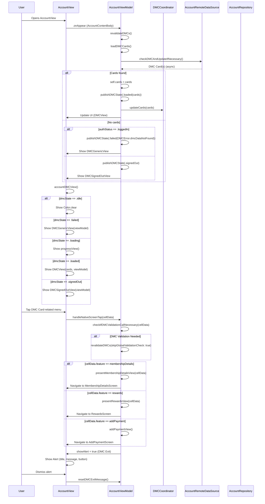
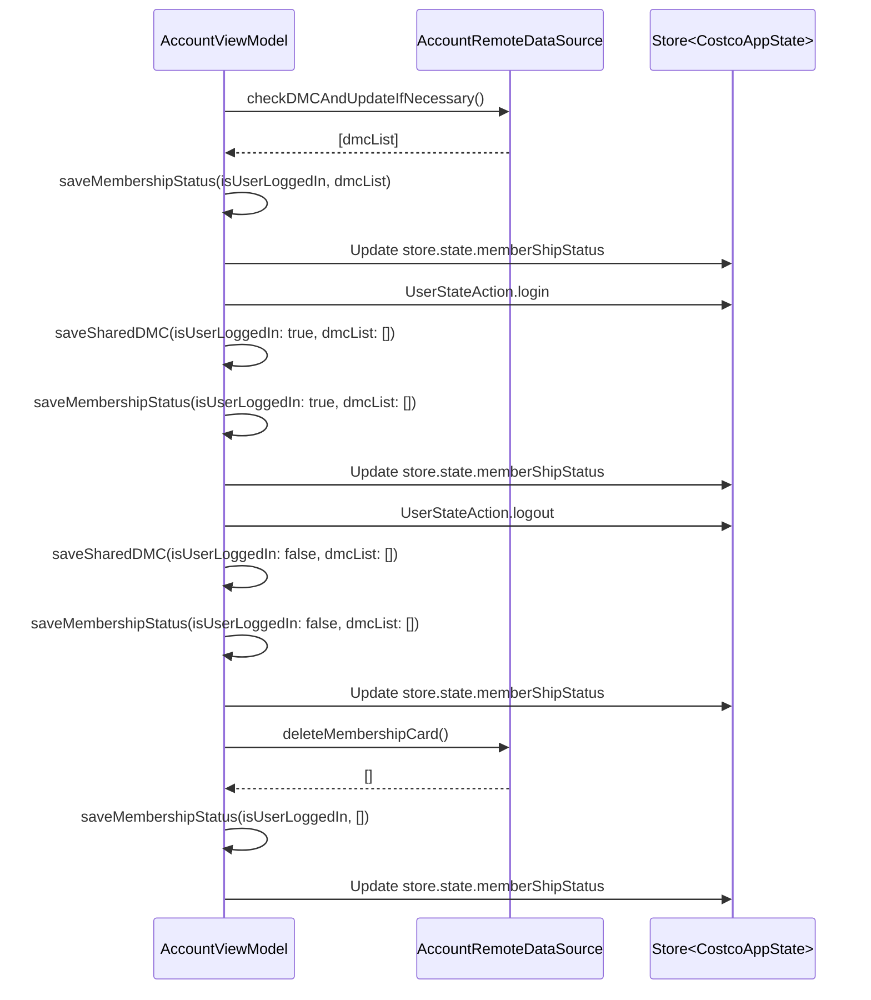
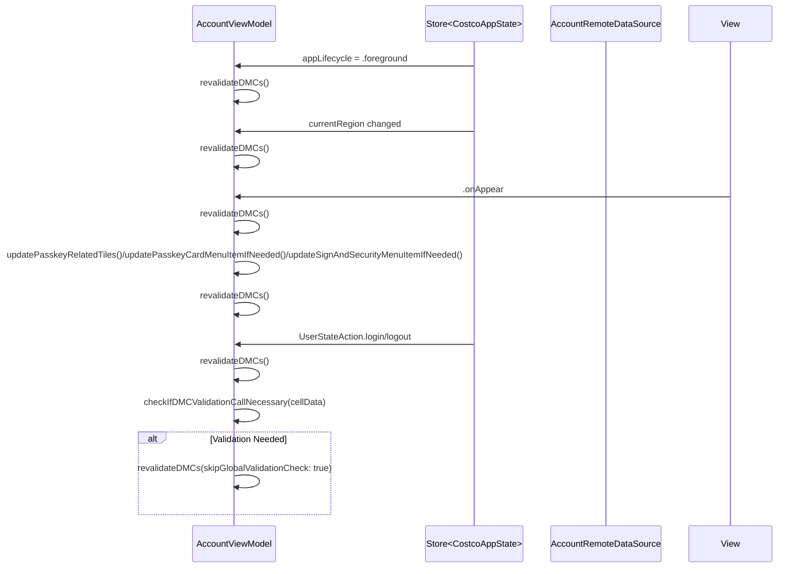

#### AccountViewModel Sequence Diagram 
---
#### DMCCard flow

---
#### membershipStatus update flow.

#### Explanation:

 - saveMembershipStatus is called after DMC card data changes (validation, delete), on user login/logout, and anytime DMC cards are updated.
 - Each call updates store.state.memberShipStatus, reflecting the current membership validity.
 - The diagram tracks these trigger points and their flow in the app.
---
#### revalidationDMC call flow

#### Explanation:
This sequence shows all situations where revalidateDMCs() is called in the app:

 - App lifecycle event
- Region change
- AccountView appearance
- Passkey/tile refresh
- User login/logout
- DMC validation trigger via menu tap
