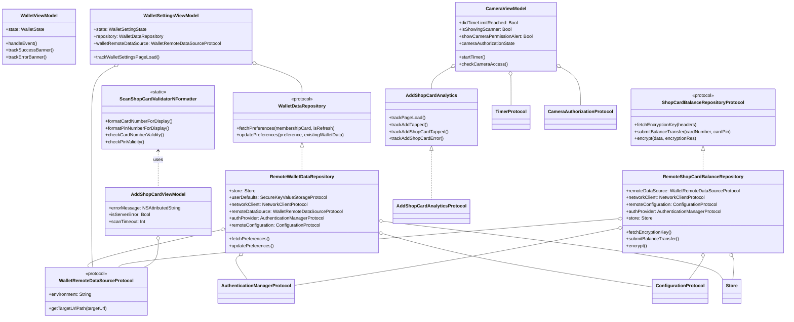

### DMC package Class Diagram

```mermaid
classDiagram
    %% Data Layer
    class WalletDataRepository {
        <<protocol>>
        +fetchPreferences(membershipCard, isRefresh)
        +updatePreferences(preference, existingWalletData)
    }
    class RemoteWalletDataRepository {
        +store: Store
        +userDefaults: SecureKeyValueStorageProtocol
        +networkClient: NetworkClientProtocol
        +remoteDataSource: WalletRemoteDataSourceProtocol
        +authProvider: AuthenticationManagerProtocol
        +remoteConfiguration: ConfigurationProtocol
        +fetchPreferences()
        +updatePreferences()
    }
    WalletDataRepository <|.. RemoteWalletDataRepository

    class WalletRemoteDataSourceProtocol {
        <<protocol>>
        +getTargetUrlPath(targetUrl)
        +environment: String
    }
    class ShopCardBalanceRepositoryProtocol {
        <<protocol>>
        +fetchEncryptionKey(headers)
        +submitBalanceTransfer(cardNumber, cardPin)
        +encrypt(data, encryptionRes)
    }
    class RemoteShopCardBalanceRepository {
        +remoteDataSource: WalletRemoteDataSourceProtocol
        +networkClient: NetworkClientProtocol
        +remoteConfiguration: ConfigurationProtocol
        +authProvider: AuthenticationManagerProtocol
        +store: Store
        +fetchEncryptionKey()
        +submitBalanceTransfer()
        +encrypt()
    }
    ShopCardBalanceRepositoryProtocol <|.. RemoteShopCardBalanceRepository

    %% ViewModels Layer
    class WalletViewModel {
        +state: WalletState
        +handleEvent()
        +trackSuccessBanner()
        +trackErrorBanner()
    }
    class WalletSettingsViewModel {
        +state: WalletSettingState
        +repository: WalletDataRepository
        +walletRemoteDataSource: WalletRemoteDataSourceProtocol
        +trackWalletSettingsPageLoad()
    }
    class AddShopCardViewModel {
        +errorMessage: NSAttributedString
        +isServerError: Bool
        +scanTimeout: Int
    }
    class CameraViewModel {
        +didTimeLimitReached: Bool
        +isShowingScanner: Bool
        +showCameraPermissionAlert: Bool
        +cameraAuthorizationState
        +startTimer()
        +checkCameraAccess()
    }
    class AddShopCardAnalytics {
        +trackPageLoad()
        +trackAddTapped()
        +trackAddShopCardTapped()
        +trackAddShopCardError()
    }
    class ScanShopCardValidatorNFormatter {
        <<static>>
        +formatCardNumberForDisplay()
        +formatPinNumberForDisplay()
        +checkCardNumberValidity()
        +checkPinValidity()
    }

    %% Relationships
    RemoteWalletDataRepository o-- WalletRemoteDataSourceProtocol
    RemoteWalletDataRepository o-- AuthenticationManagerProtocol
    RemoteWalletDataRepository o-- ConfigurationProtocol
    RemoteWalletDataRepository o-- Store

    WalletSettingsViewModel o-- WalletDataRepository
    WalletSettingsViewModel o-- WalletRemoteDataSourceProtocol

    RemoteShopCardBalanceRepository o-- WalletRemoteDataSourceProtocol
    RemoteShopCardBalanceRepository o-- AuthenticationManagerProtocol
    RemoteShopCardBalanceRepository o-- ConfigurationProtocol
    RemoteShopCardBalanceRepository o-- Store

    AddShopCardViewModel o-- WalletRemoteDataSourceProtocol

    CameraViewModel o-- AddShopCardAnalytics
    CameraViewModel o-- TimerProtocol
    CameraViewModel o-- CameraAuthorizationProtocol

    AddShopCardAnalytics <|.. AddShopCardAnalyticsProtocol

    %% Utility
    ScanShopCardValidatorNFormatter <.. AddShopCardViewModel : uses
```
