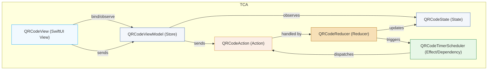

Explanation:

QRCodeView: SwiftUI view, observes the Store/ViewModel and sends user actions.
QRCodeViewModel (Store): Owns QRCodeState, receives actions from view, exposes state to the view.
QRCodeState: Holds QR code value, expiration, validity, etc.
QRCodeAction: Enum of user/system actions (refresh, tick, expire).
QRCodeReducer: Handles actions, updates state, triggers effects/timers.
QRCodeTimerScheduler: Timer effect/dependency; dispatches actions (e.g., tick, expire) back to the store.
