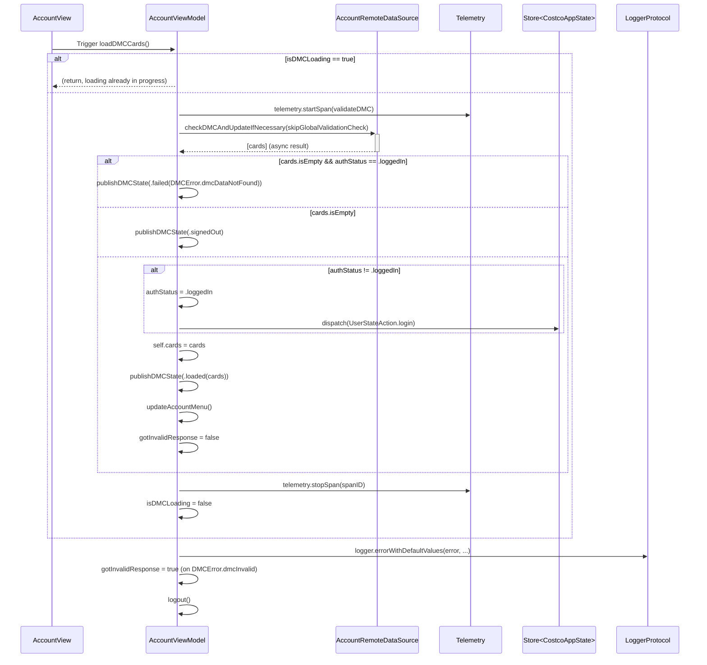

#### AccountViewModel Sequence Diagram for DMCCard

```mermaid
sequenceDiagram
    participant View as AccountView
    participant VM as AccountViewModel
    participant Repo as AccountRemoteDataSource
    participant Tele as Telemetry
    participant Store as Store<CostcoAppState>
    participant Logger as LoggerProtocol

    View->>+VM: Trigger loadDMCCards()
    alt isDMCLoading == true
        VM-->>View: (return, loading already in progress)
    else
        VM->>Tele: telemetry.startSpan(validateDMC)
        VM->>+Repo: checkDMCAndUpdateIfNecessary(skipGlobalValidationCheck)
        Repo-->>-VM: [cards] (async result)
        alt cards.isEmpty && authStatus == .loggedIn
            VM->>VM: publishDMCState(.failed(DMCError.dmcDataNotFound))
        else cards.isEmpty
            VM->>VM: publishDMCState(.signedOut)
        else
            alt authStatus != .loggedIn
                VM->>VM: authStatus = .loggedIn
                VM->>Store: dispatch(UserStateAction.login)
            end
            VM->>VM: self.cards = cards
            VM->>VM: publishDMCState(.loaded(cards))
            VM->>VM: updateAccountMenu()
            VM->>VM: gotInvalidResponse = false
        end
        VM->>Tele: telemetry.stopSpan(spanID)
        VM->>VM: isDMCLoading = false
    end
    %% Error Handling
    VM->>Logger: logger.errorWithDefaultValues(error, ...)
    VM->>VM: gotInvalidResponse = true (on DMCError.dmcInvalid)
    VM->>VM: logout()
```
