#### MyAccount, DMC packages Class Diagram

```mermaid
classDiagram
    %% --- MyAccount Main ViewModel and Dependencies ---
    class AccountViewModel {
        <<ObservableObject>>
        +repository: AccountRepositoryProtocol
        +myAccountAppDataSource: MyAccountAppDataSourceProtocol
        +accountRemoteDataSource: AccountRemoteDataSourceProtocol
        +analytics: AnalyticsProtocol
        +router: RouterProtocol
        +userDefaults: KeyValueStoreProtocol
        +store: Store<CostcoAppState>
        +cards: [DmcMembershipCardModel]
        +moreMenu: [MenuSectionModel]
        +walletCoordinator: WalletCoordinator
        +authenticationManager: AuthenticationManagerProtocol
        +passkeyManager: PasskeyManagerProtocol
        +secureDefaults: SecureKeyValueStorageProtocol
        +emailHandler: PasskeyEmailNotifier
        +passkeyAnalytics: PasskeyAnalyticsProtocol
        +navigationController: UINavigationController
        ...
    }

    class AccountRepositoryProtocol {
        +fetchMoreMenu()
        +dmcValidationConfig
        +isDMCHalfSheetEnabled
        ...
    }

    class AccountRemoteDataSourceProtocol {
        +checkDMCAndUpdateIfNecessary()
        +getDMCData()
        +deleteMembershipCard()
        +updateDMCPayment()
        ...
    }

    class MyAccountAppDataSourceProtocol
    class AnalyticsProtocol
    class RouterProtocol
    class KeyValueStoreProtocol
    class SecureKeyValueStorageProtocol
    class AuthenticationManagerProtocol
    class PasskeyManagerProtocol
    class PasskeyAnalyticsProtocol
    class PasskeyEmailNotifier
    class WalletCoordinator
    class Store~CostcoAppState~
    class TelemetryProtocol
    class UINavigationController

    class DmcMembershipCardModel
    class DMCDataModel {
        +digitalCards: [DmcMembershipCardModel]
        +dmcHash: String
    }
    class DMCMessageDTO

    class MenuSectionModel {
        +items: [MenuItemModel]
        +feature: String
        ...
    }
    class MenuItemModel {
        +title: String
        +feature: String
        ...
    }

    %% --- DMC Package Core Models and Relations ---
    class MemberKindModel {
        +code: String
        +name: String
    }
    class TierModel {
        +code: String
        +name: String
    }
    class MemberRole {
        +code: String
        +name: String
    }
    class BusinessLicense
    class PaymentsDetail
    class DigitalMembershipCardRewardEstimateModel

    class WalletDataRepository {
        +fetchPreferences(membershipCard: DmcMembershipCardModel, isRefresh: Bool)
    }
    class WalletFeature
    class WalletData

    %% --- Relationships: MyAccount to DMC Package ---
    AccountViewModel --> AccountRepositoryProtocol
    AccountViewModel --> AccountRemoteDataSourceProtocol
    AccountViewModel --> MyAccountAppDataSourceProtocol
    AccountViewModel --> AnalyticsProtocol
    AccountViewModel --> RouterProtocol
    AccountViewModel --> KeyValueStoreProtocol
    AccountViewModel --> SecureKeyValueStorageProtocol
    AccountViewModel --> PasskeyManagerProtocol
    AccountViewModel --> PasskeyAnalyticsProtocol
    AccountViewModel --> WalletCoordinator
    AccountViewModel --> AuthenticationManagerProtocol
    AccountViewModel --> PasskeyEmailNotifier
    AccountViewModel --> Store~CostcoAppState~
    AccountViewModel --> TelemetryProtocol
    AccountViewModel --> UINavigationController
    AccountViewModel --> DmcMembershipCardModel : cards
    AccountViewModel --> MenuSectionModel : moreMenu

    AccountRepositoryProtocol --> AccountRemoteDataSourceProtocol
    AccountRemoteDataSourceProtocol --> DMCDataModel : returns
    AccountRemoteDataSourceProtocol --> DmcMembershipCardModel : returns

    MenuSectionModel --> MenuItemModel : items

    %% --- DMC Data Model Relations ---
    DMCDataModel --> DmcMembershipCardModel : digitalCards
    DmcMembershipCardModel --> MemberKindModel : kind
    DmcMembershipCardModel --> TierModel : tier
    DmcMembershipCardModel --> MemberRole : memberRole
    DmcMembershipCardModel --> PaymentsDetail : payments
    DmcMembershipCardModel --> BusinessLicense : businessLicenses
    DmcMembershipCardModel --> DigitalMembershipCardRewardEstimateModel : rewardEstimate

    %% --- Wallet Integration ---
    WalletCoordinator --> DmcMembershipCardModel
    WalletDataRepository --> DmcMembershipCardModel : fetchPreferences()
    WalletData --> DmcMembershipCardModel : membershipCardNumber
    WalletData --> WalletFeature : features
```

Grouped breakdown

Groups

1. Authentication & Membership

 - Handle logout UI and functionality. Show sign In screen and actions
 - Handle verify membership scenario and functionality
2. Membership Experience

 - Create Membership UI happy path
 - Create DMC half sheet UI
 - Handle deep linking to DMC from widget
 - Inactive status for DMC
3. Navigation & Platform

 - Create a common Navigation to handle web navigation
 - Replace UIBuilder for iPad support
4. App Lifecycle & Region

 - Handle region change, app life cycle
````
Account Modernization
├── Authentication & Membership
│   ├── Handle logout UI and functionality. Show sign In screen and actions
│   └── Handle verify membership scenario and functionality
│
├── Membership Experience
│   ├── Create Membership UI happy path
│   ├── Create DMC half sheet UI
│   ├── Handle deep linking to DMC from widget
│   └── Inactive status for DMC
│
├── Navigation & Platform
│   ├── Create a common Navigation to handle web navigation
│   └── Replace UIBuilder for iPad support
│
└── App Lifecycle & Region
    └── Handle region change, app life cycle
````
