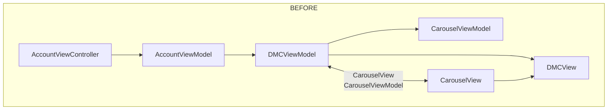
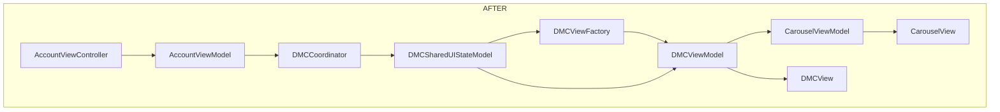

#### DMCView refactoring #[10528](https://github.com/costcomobility/Costco-iOS/pull/10528) by @Assem

# DMCView Refactor: Before and After

## BEFORE (Old Design)

- **DMCViewModel** directly managed state and carousel logic.
- Coordination between views and state was less centralized.
- Deep link/card selection logic was spread across both view and view model.
- UI state (such as tracking page loads) was less modular.
- **CarouselView/TabView** logic was more tightly coupled with the parent view.

## AFTER (New Design)

- Introduced **DMCSharedUIStateModel** as a central `ObservableObject` for UI state, including card selection and tracking flags.
- **DMCCoordinator** now initializes and manages a single `DMCSharedUIStateModel`, passing it to factories and view models.
- Card selection (especially deep linking) is handled via the shared UI state, with observers updating views accordingly.
- **CarouselViewModel** and **DMCViewModel** refactored: more separation of concerns, view factories injected, and `Combine` used for state observation.
- UI tracking and analytics are enabled/disabled via a new flag in the shared state model.
- Refactored **CarouselView** to use SwiftUI’s `TabView` and preference keys for dynamic sizing.
- **AccountViewModel** and **AccountViewController** now interact with the new `updateCurrentSelectionToCardNumber` logic for card selection.

````
BEFORE
-------
[AccountViewController]
      |
      v
[AccountViewModel] --(direct state updates)--> [DMCViewModel]
      |                                      /      |
      |-----------------------------<--------       v
       (Some logic inside View)            [CarouselViewModel]
      |                                      |
      v                                      v
[CarouselView] <--- tightly coupled ----> [DMCView]

AFTER
------
[AccountViewController]
      |
      v
[AccountViewModel] --(calls)--> [DMCCoordinator]
                                      |
                                      v
                       [DMCSharedUIStateModel] <--- central UI state (card num, tracking)
                                      |
                                      v
                             [DMCViewFactory]
                                      |
                                      v
                               [DMCViewModel]
                                      |
                                      v
                              [CarouselViewModel]
                                      |
                                      v
                                 [CarouselView]
(All card selection, deep link, and tracking logic now flow through DMCSharedUIStateModel)
````



