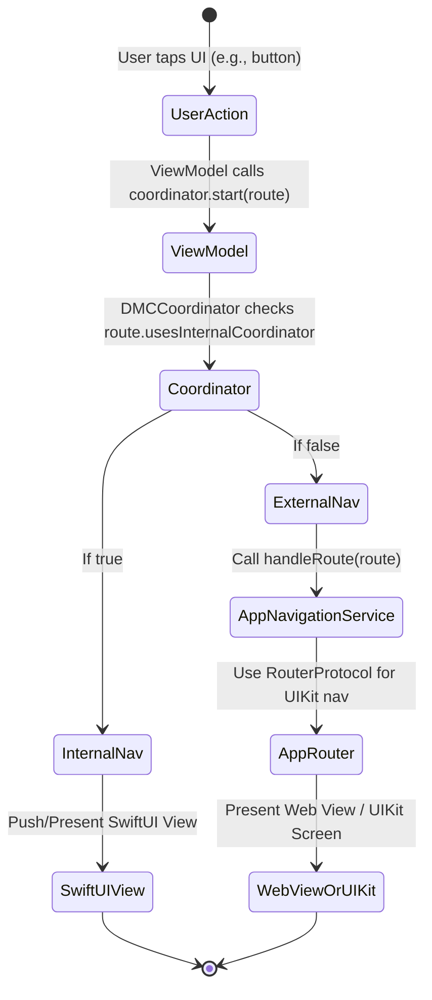

# DMC Navigation Logic

## Overview

This document explains the new navigation logic and routing system introduced in the DMC module. The navigation logic now supports both internal (SwiftUI-based) and external RouterProtocol navigation, allowing for more flexible and maintainable routing throughout the Digital Membership Card (DMC) feature.

---

## Key Concepts

### 1. `NavigationRoute` Protocol

- Extended with a new property:
  - `usesInternalCoordinator: Bool`: Determines whether navigation should use the internal `DMCCoordinator` (SwiftUI/Coordinator pattern) or delegate to the app's `RouterProtocol` (UIKit-based navigation).

### 2. `DMCRoute` Enum

- Expanded with new cases for navigation:
  - `.signIn(isPresented: Bool)`
  - `.addPayment(card: DmcMembershipCardModel)`
  - `.renew(card: DmcMembershipCardModel)`
- Implements `usesInternalCoordinator` to switch between navigation types:
  - For `.signIn`, `.addPayment`, and `.renew`, returns `false` (external navigation).
  - All other cases return `true` (internal navigation).

### 3. `DMCCoordinator`

- Checks the `usesInternalCoordinator` property:
  - If `true`, uses internal SwiftUI navigation (e.g., pushes a SwiftUI view).
  - If `false`, delegates navigation to `AppNavigationService` for external handling.

### 4. `AppNavigationService`

- Implements the actual routing logic for external navigation, using UIKit and the app's router.
- Handles routes such as:
  - Presenting or pushing the sign-in screen
  - Navigating to add payment screens
  - Navigating to renewal screens
- Composes the necessary parameters and context for each navigation action.

### 5. ViewModels

- `DMCCardViewModel`, `DMCExpireViewModel`, and `DMCSignedOutViewModel` now receive a (weak) reference to the `DMCCoordinator` so they can trigger navigation.
- These ViewModels call `.start(.route)` on the coordinator, which then decides how to navigate based on the route.

---

## Loose Coupling & Common Navigation Source

The design ensures **loose coupling** and reusability in the navigation logic for web views by following these principles:

- **Abstracted Navigation Interface:**  
  All navigation requests are represented by the `NavigationRoute` protocol and the `DMCRoute` enum. The `usesInternalCoordinator` property abstracts *how* navigation happens, so the ViewModels and the rest of the codebase do not care if the navigation is SwiftUI-based or UIKit-based.

- **Delegation to Common Router Logic:**  
  When navigation should be external (web view), the logic is delegated to a single source:  
  `AppNavigationService` uses the app-wide `RouterProtocol` (such as `AppModuleRouter`) to actually perform the navigation.  
  This means:
  - There is **one place** (`AppNavigationService`) responsible for constructing routes and parameters for web views.
  - The navigation logic is **not duplicated** across multiple features or modules.
  - If the web navigation logic changes, it only needs to be updated in one place.

- **Costco Navigation Logic Integration:**  
  The Costco navigation logic, via `RouteProtocol` and `AppModuleRouter`, is used as the backbone for all web navigation.  
  - `AppNavigationService` receives a reference to the app's `RouterProtocol` implementation (`AppModuleRouter`) and uses it to perform navigation.
  - All routes that map to a web view (e.g., sign-in, add payment, renew membership) are funneled through this common interface.
  - This makes it possible for different modules and features to navigate to web views in a consistent, maintainable manner.

### Example: Web View Navigation Flow

1. **ViewModel triggers navigation:**  
   Calls `coordinator?.start(.signIn(isPresented: false))`
2. **Coordinator checks route:**  
   Sees that `.signIn` is an external route (`usesInternalCoordinator == false`)
3. **Delegation:**  
   Calls `AppNavigationService.handleRoute(.signIn(isPresented: false))`
4. **AppNavigationService:**  
   Builds the appropriate parameters and calls `router.navigate(to: screen)`, where `router` is an `AppModuleRouter` conforming to `RouterProtocol`.
5. **Web View Presentation:**  
   The app's router presents the web view using the provided context and parameters.

---

### DMC Navigation Logic Flow

1. **User Action**
    - *Trigger:* User taps a button or interacts with the UI.
2. **ViewModel Handles Event**
    - *Action:* ViewModel calls `coordinator.start(route)` with the desired navigation route.
3. **Coordinator Decision**
    - *Check:* The coordinator inspects the route's `usesInternalCoordinator` property.
    - **If `usesInternalCoordinator` is `true`:**
        - ➡️ `DMCCoordinator` directly pushes or presents a SwiftUI view.
    - **If `usesInternalCoordinator` is `false`:**
        - ➡️ `DMCCoordinator` calls `AppNavigationService.handleRoute(route)`.
4. **AppNavigationService Handling (External Navigation)**
    - *Builds navigation context and parameters for the web view or external screen.*
    - Calls the app's `RouterProtocol` (e.g., `AppModuleRouter`) to perform navigation.
5. **AppModuleRouter**
    - *Executes the navigation using UIKit (push, present, etc.) and renders the correct web view.*

---

#### Visual Summary

| Step | Responsible Component            | Action/Decision                                                    |
|------|----------------------------------|--------------------------------------------------------------------|
| 1    | User/UI                          | Triggers navigation (e.g., button tap)                             |
| 2    | ViewModel                        | Calls `coordinator.start(route)`                                   |
| 3    | DMCCoordinator                   | Checks route type:<br>• Internal → SwiftUI push<br>• External → Delegate |
| 4    | AppNavigationService (if needed) | Constructs context, calls RouterProtocol                           |
| 5    | AppModuleRouter                  | Presents the web view or UIKit page                                |

---

## Flow Diagram



---

## Example Usage

### Internal Navigation (Default)

- For most routes, navigation remains within SwiftUI (`DMCCoordinator`).

```swift
await coordinator?.start(.dmcView)
```

### External Navigation (Web View)

- For routes like sign-in and add payment, navigation is delegated:

```swift
await coordinator?.start(.signIn(isPresented: true))
```
- This will invoke `AppNavigationService.handleRoute(.signIn(isPresented: true))`,
  which will present the sign-in page using UIKit through the common app router.

---

## Benefits

- **Loose coupling:** ViewModels and UI do not know or care how navigation is performed.
- **Centralized web view navigation:** All routes to web views are managed through a single service and router.
- **Reusability:** Any new feature can navigate to a web view by simply adding a route and handling it in the common service.
- **Consistency:** All web navigation follows the Costco navigation logic (`RouteProtocol` and `AppModuleRouter`)—no more custom or duplicated navigation flows.

---

## References

- [NavigationRoute.swift](../DI/NavigationRoute.swift)
- [DMCRoute.swift](../Models/DMCRoute.swift)
- [DMCCoordinator.swift](../Membership/DI/DMCCordinator.swift)
- [AppNavigationService.swift](../Membership/DI/AppNavigationService.swift)
- [RouterProtocol & AppModuleRouter (Costco Navigation Logic)](path/to/app/router/files)
