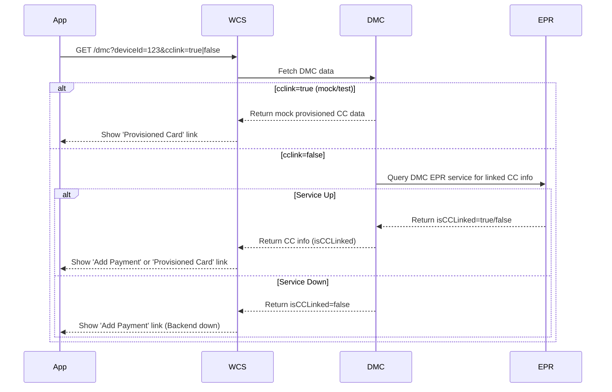
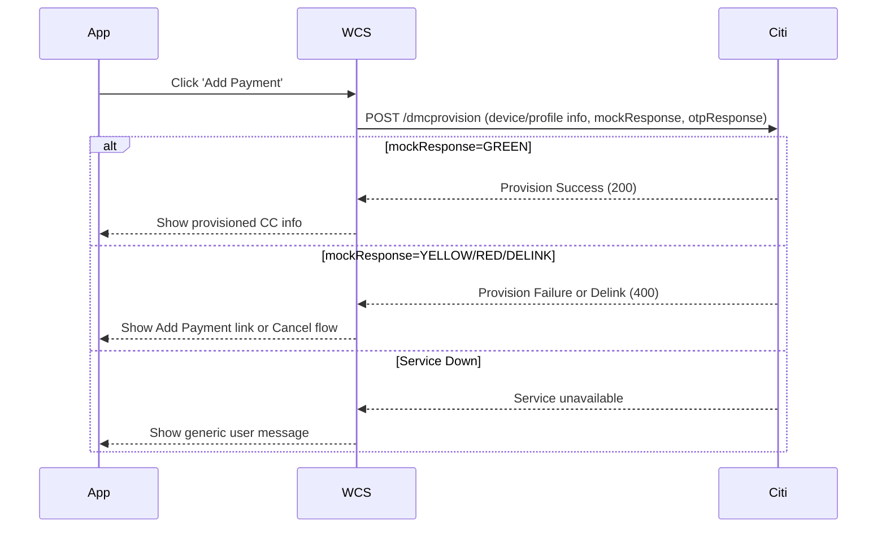
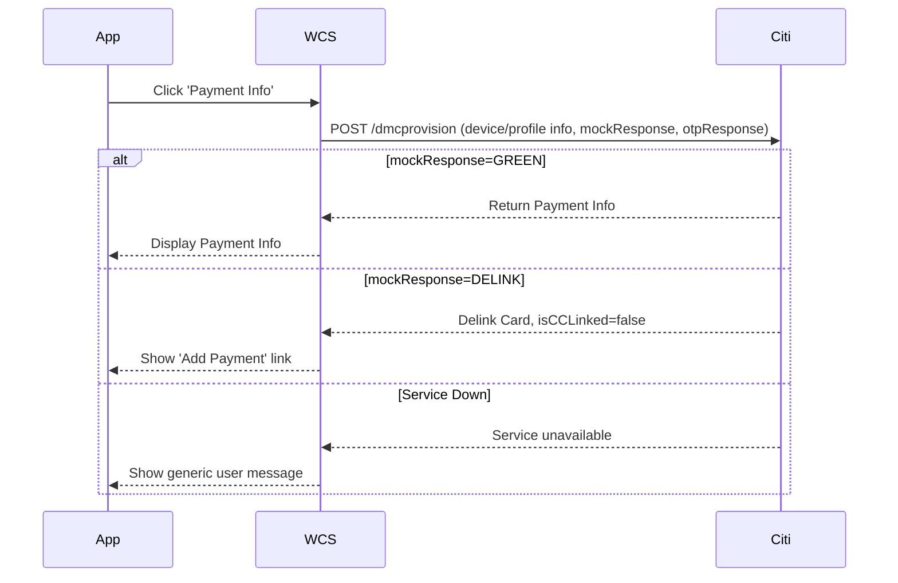

# DMC Payment Flow – App & WCS Integration

## Overview

This document describes the flows for displaying payment-related UI in the app, based on DMC fetch and validation, and handling provisioning and delinking of credit cards via WCS and backend services.

---

## 1. UI Display Logic

- Show link: **‘Add Payment’** or **'Payment Info'**
- **Pilot users:**  
  - If `payments` data is non-empty, show payment-related UI.
  - If `payments` is empty, hide payment-related UI.

---

## 2. DMC Fetch (DMCHelper.java)

**Endpoint:**  
`https://www-vqa6.costco.com/dmc?deviceId=123&cclink=true|false`

- **`cclink=true`**: Returns **mock linked CC data** (for test); shows 'provisioned card' link.
- **`cclink=false`**: Pulls linked CC info from DMC EPR service; shows 'add payment' link.

> `cclink` is a temporary param for mock/test and must be removed when backend services are ready.

---

## 3. Sequence Diagram: DMC Fetch



---

## 4. DMC JSON Payload (with payments data)

```json
{
  "digitalCards": [
    {
      "memberCardNumber": "string",
      // ... other card info ...
      "payments": {
        "isCCLinked": true,    // CC provisioned via DMC-EPR service? Added to dmcHash
        "ccProductType": "Visa",
        "ccDigits": "1234"
      }
    }
  ],
  "dmcHash": "string"
}
```

---

## 5. DMC Validation (Refresh) – DMCValidationCmd.java

**Payload Example:**

```json
{
  "status": "valid",
  "rewardEstimates": [
    // ... estimates ...
  ],
  "payments": {
    "memberCardNumber": "string",
    "isCCLinked": true
  }
}
```

---

## 6. Display Rules

- **Show 'Add Payment' link:**  
  - If `isCCLinked` is **false** in JSON
  - If backend services are **down**
- **Show provisioned CC:**  
  - If `isCCLinked` is **true**
  - Linked CC is retrieved from DMC service
- **Backend Down:**  
  - Show ‘Add Payment’ link and/or generic user message

---

## 7. Sequence Diagram: Add Payment Flow



---

## 8. Sequence Diagram: Payment Info (Delink) Flow



---

## 9. Error Handling

- If backend services are down or provisioning fails:
  - WCS displays a **generic user message**
  - ‘Cancel’ flow: App returns to previous state, DMC remains unchanged.

---

## References

- [DMC Test Data Google Sheet](https://docs.google.com/spreadsheets/d/1TmZkhx5Zhd2lkV_JqlFTIaosvSWB0fFU1PmZzwvq700/edit?usp=sharing)
- [DMC/CITI: Data json](https://docs.google.com/document/d/1ydwSCgp4k91vF_hiNjxxQ5F-YW3MR-jhuFlQi8XvRmU/edit?tab=t.0)
