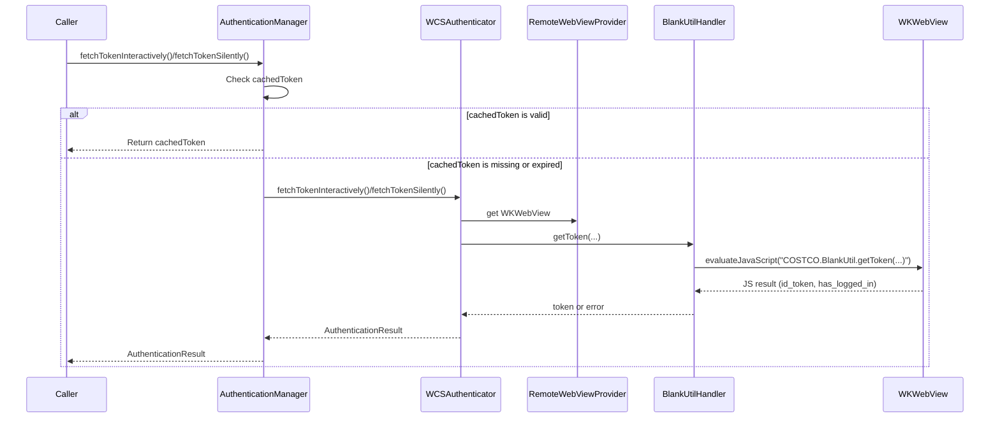
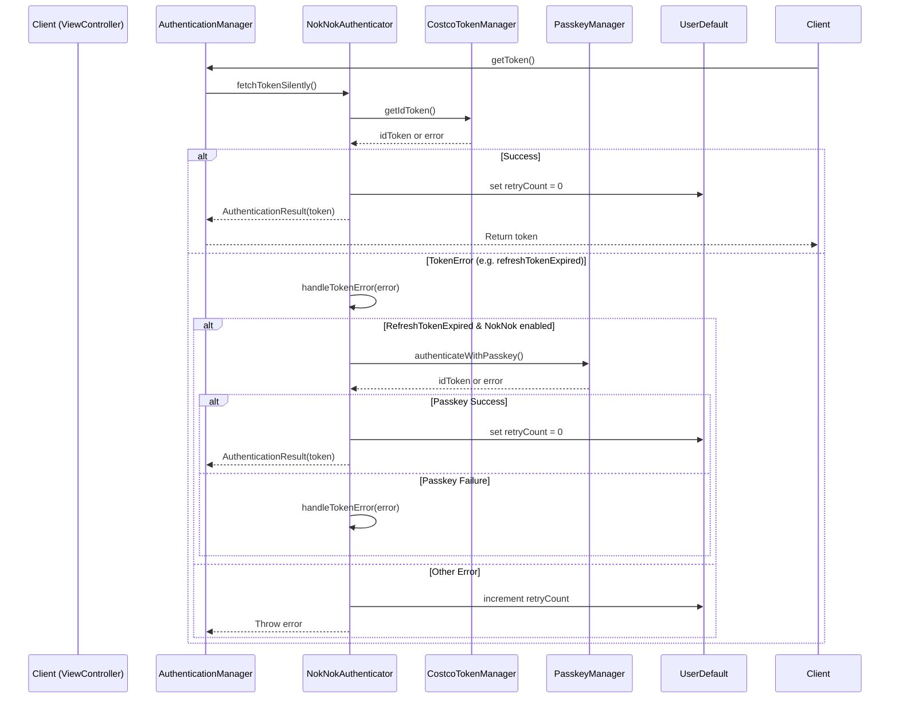
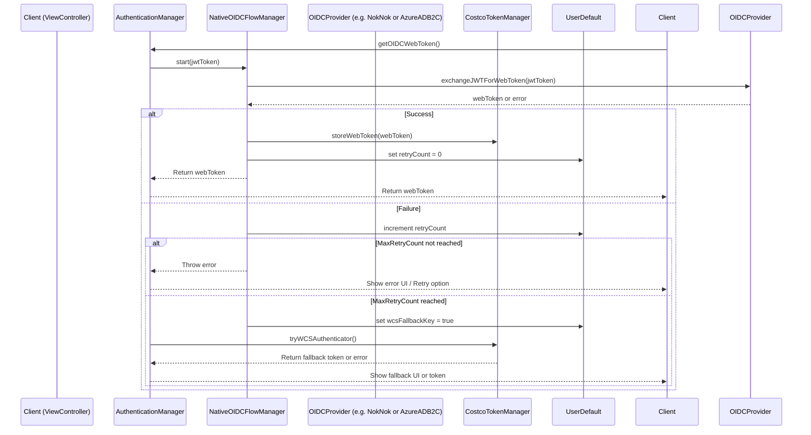

#### `getToken()` sequence Diagram (tokenProvider == .wcs)

#### `getToken()` sequence Diagram (tokenProvider == .noknok)

#### `getOIDCWebToken()` sequence Diagram (tokenProvider == .wcs && isOAuthWebLoginProviderEnabled == true)

# How Often and When is `getToken()` Called?

## When is it called?

### 1. User-Initiated Login
- When the user logs in via the app’s UI (e.g., pressing a "Sign In" button), the login flow triggers `fetchTokenInteractively()`, which leads to a call to `getToken()` via the authenticator.

### 2. Silent Authentication (Token Refresh)
- When the app launches and the user is already signed in, the app may call `fetchTokenSilently()` to refresh or validate the session/token in the background.
- This may also occur when the app enters the foreground after being in the background, to refresh the token or check session validity.

### 3. WebView Requests (Hybrid Flows)
- If a `WKWebView` (web content) needs a token for authenticated API calls, it may use a native JavaScript bridge (`NativeAuthenticationHandler`) to request a token, which calls `fetchTokenInteractively()` or `fetchTokenSilently()`.

### 4. Authentication/Session Events
- After certain events, such as password changes, session expiration, or explicit logout/login, the app may need to fetch a new token.

### 5. API Calls Requiring Authentication
- If an API call fails due to an expired token, the app might trigger a token refresh flow.

---

## How Often is it Called?

- **On User Login:** Once per login attempt.
- **On App Launch (if already signed in):** Once per launch (silent refresh).
- **On App Foreground:** Each time the app returns to foreground (silent refresh).
- **On WebView Requests:** Each time the WebView requests a token (can be frequent if hybrid content needs tokens).
- **On Session Expiry:** When a session expires and needs renewal.

---

## In summary
`getToken()` is called at every authentication checkpoint—user login, session refresh, app launch/foreground, and whenever web/native code needs a valid token.

---

## References in the Repo

- `AuthenticationManager` is called by UI (via coordinators, view models), and by `NativeAuthenticationHandler` (for WebView).
- Token fetch is triggered on app launch, foreground, login, and WebView JS requests.
