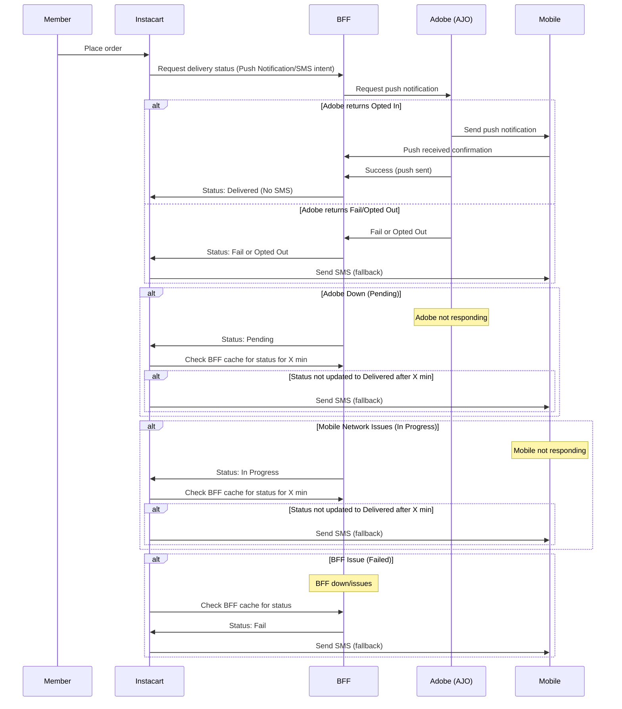

#### Transaction Messaging Flow.

```mermaid
sequenceDiagram
    participant Member as Member
    participant IC as Instacart
    participant B as BFF
    participant A as Adobe (AJO)
    participant M as Mobile

    Member->>IC: Place order
    IC->>B: Request delivery status (Push Notification/SMS intent)
    B->>A: Request push notification
    alt Adobe returns Opted In
        A->>M: Send push notification
        M->>B: Push received confirmation
        A->>B: Success (push sent)
        B->>IC: Status: Delivered (No SMS)
    else Adobe returns Fail/Opted Out
        A->>B: Fail or Opted Out
        B->>IC: Status: Fail or Opted Out
        IC->>M: Send SMS (fallback)
    end

    alt Adobe Down (Pending)
        note over A: Adobe not responding
        B->>IC: Status: Pending
        IC->>B: Check BFF cache for status for X min
        alt Status not updated to Delivered after X min
            IC->>M: Send SMS (fallback)
        end
    end

    alt Mobile Network Issues (In Progress)
        note over M: Mobile not responding
        B->>IC: Status: In Progress
        IC->>B: Check BFF cache for status for X min
        alt Status not updated to Delivered after X min
            IC->>M: Send SMS (fallback)
        end
    end

    alt BFF Issue (Failed)
        note over B: BFF down/issues
        IC->>B: Check BFF cache for status
        B->>IC: Status: Fail
        IC->>M: Send SMS (fallback)
    end
```
